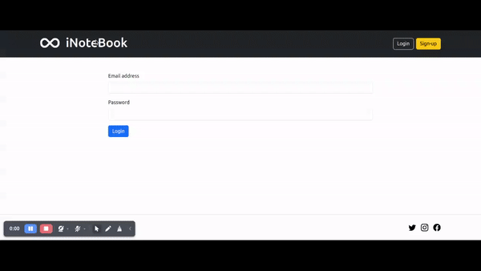
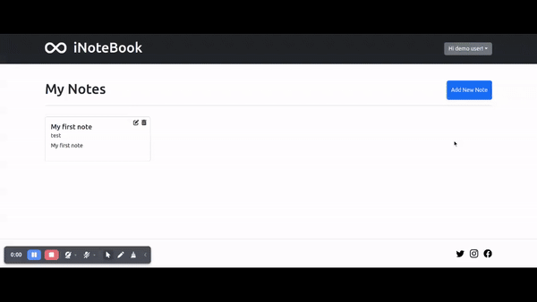

# iNoteBook

Welcome to the iNoteBook GitHub repository!

iNoteBook is a personal notes app built using the MERN stack (MongoDB, Express.js, React, Node.js). It provides users with the ability to sign up or log in securely. Once logged in, users can create, view, edit, and manage their personal notes efficiently.User authentication is handled using JSON Web Tokens (JWT).




## Installation

### Frontend Setup

- Clone the repository:

```bash
  git clone https://github.com/swapnilghone/inotebook.git
```
- Navigate to the project directory:
```bash
  cd inotebook
```
- Install dependencies:
```bash
  npm install
```
- Create `.env` file under inotebook directory
- Define following under `.env` file
```.env
  REACT_APP_API_URL=URL_ON_WHICH_YOU_WILL_RUN_BACKEND
  JWT_SECRET=YOUR_JWT_SECRET_TOKEN
```

### Backend Setup

- Navigate to the project backend directory:
```bash
  cd inotebook/backend
```
- Install dependencies:
```bash
  npm install
```
- Create `.env` file under `inotebook/backend` directory
- Define following under `.env` file
```.env
  JWT_SECRET=YOUR_JWT_SECRET_TOKEN
```
## Usage

To start both the backend and frontend servers concurrently:
```bash
npm run both
```

> [!IMPORTANT]
> This script requires the concurrently package.


## Features
- User Authentication: The app supports user registration and login functionality. Each user has a unique set of credentials to access their notes securely.
- Create and Edit Notes: Users can create new notes and edit existing ones. The app provides a user-friendly interface to compose and format notes with rich text editing capabilities.
- Store Notes: The notes created by users are securely stored in the backend database, ensuring data persistence and accessibility across multiple sessions.
- User-Specific Notes: Each user has their own set of notes associated with their account. This ensures privacy and organization for each user's personal notes.
- Search and Filter: The app allows users to search and filter their notes based on keywords or categories, making it easy to find specific information.
- Responsive Design: The frontend of the app is built using React, providing a responsive and interactive user interface that adapts to different devices and screen sizes.


## Dependencies
- Node version: >=20.11.0
- Npm version: >=0.39.1
- React version: 18.2
- React Router DOM version: 6.21
- MongoDB
- Nodemon
## Tech Stack

**Client:** React, JSX, Bootstrap

**Server:** Node, Express

**Server:** MongoDB

**Authentication:** JSON Web Tokens (JWT)
## License

NewsMonk is licensed under the MIT License - see the [LICENSE.TXT](LICENSE.TXT) file for details


## Authors

**Swapnil Ghone** - [iNoteBook](https://github.com/swapnilghone/inotebook)


## 🔗 Links
[](https://github.com/swapnilghone)

[](https://www.linkedin.com/in/swapnil-ghone/)

## Contributing

Contributions are always welcome!

Please feel free to fork the repository and submit pull requests.